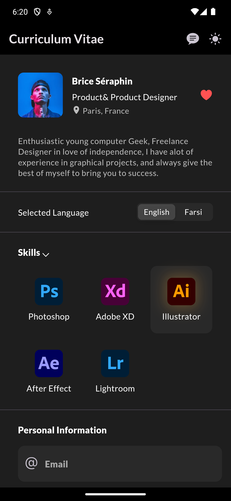
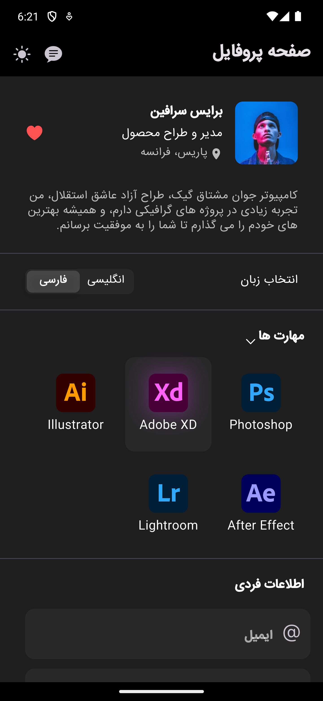
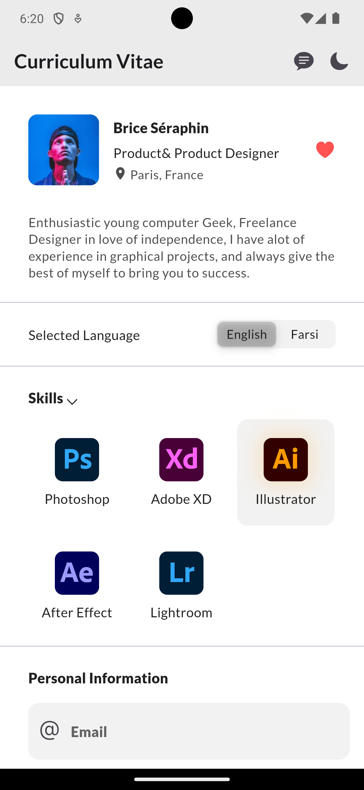
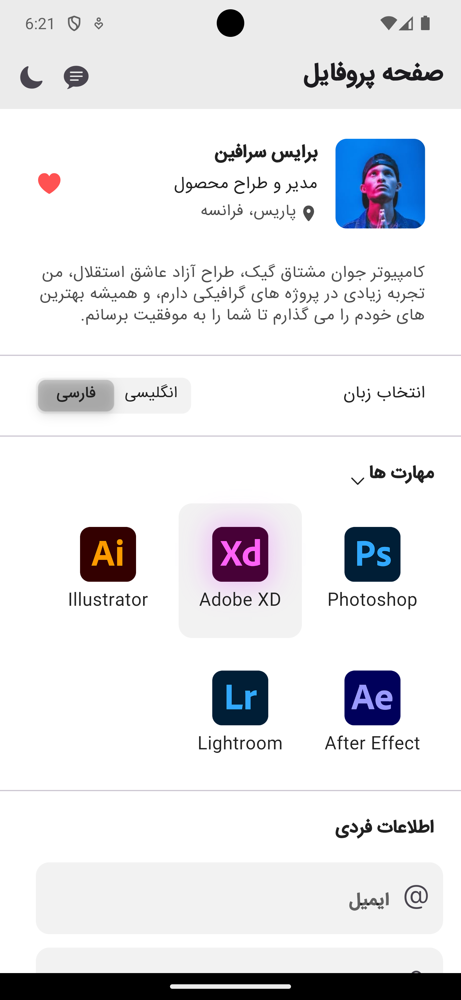

# User Profile Mobile App

This Flutter mobile application allows users to view their profile page with the capability to switch between dark and light themes and support for bilingual "Persian and English".

## Introduction

This mobile app is designed to provide a seamless user experience for viewing and managing user profiles. It offers a visually appealing interface with support for dark and light themes, as well as bilingual support for Persian and English languages.

## Features

- View user profile details
- Switch between dark and light themes
- Bilingual support for Persian and English languages

## Screenshots

### Profile Page

### Dark Theme

### Light Theme

### Persian Language

### English Language

## Getting Started

To get started with the app, follow these steps:
1. Clone the repository.
2. Navigate to the project directory.
3. Run the command `flutter run` to launch the app on your device.

Feel free to explore the app and provide feedback!

## Contributors

- Mehdi Safdari